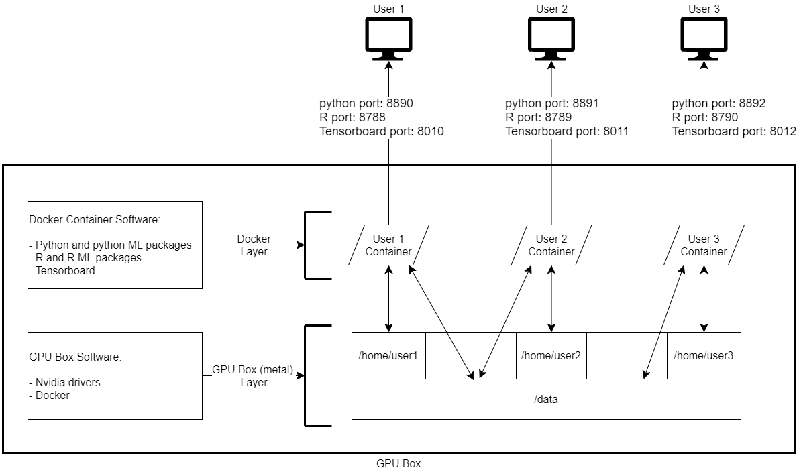

# Basic

Q: What is the GPU Box?   
A: The GPU Box is a server running Ubuntu 18.04. It has 4 Nvidia Titan V GPUs, 128 GB of RAM, and 12 CPU cores.

Q: Where should I start?  
A: [The webapp](www.eri-gpu.cho.elderresearch.com). Here you can launch sessions on the GPU box and find links to Jupyter Lab and R studio

Q: How should I reserve GPU time?   
A: Please use the [GPU Google Calendar](https://calendar.google.com/calendar/embed?src=datamininglab.com_6taegbbncqqjuv6pum1fo61ej8%40group.calendar.google.com&ctz=America%2FNew_York)

Q: What is the basic setup of the GPU Box?   
A: The [webapp](www.eri-gpu.cho.elderresearch.com) launches `docker` containers with all the packages and tools you need for machine learning enjoyment. Each container exposes Jupyter Lab, Rstudio, and Tensorboard, all viewable using a web browser (user must be on the ERI Network). Each container is also mapped to the user's home directory on the Box (`/home/<username>`) and the shared data directory (`/data`) on the Box. The below diagram might be easier to follow:



Q: Where should I store code?   
A: In your home directory `/home/<username>`. The recommended way to put code here is using `git clone`. Please follow [these instructions](#Using-Gitlab-repositories-on-the-Box) for setting up the Box with ERI's Gitlab.

Q: Where should I store data?   
A: In the data directory `/data`. The recommended way to put data here is using `scp` (assuming `ssh` has been setup). GUIs like WinSCP or Cyberduck are also advisable. Please follow [these specifications](##Shared-data-directory-rules) for all data in the `/data` directory. 

Q: Python - how should I run scripts?    
A: In Jupyter Lab, open a terminal and run `python3 path/to/script.py`

Q: What if I need python/R/linux packages that are not installed in the docker containers?   
A: You have a few options:
  1. Ask for help in #gpu_users
  2. File an issue https://github.com/ElderResearch/gpu_docker/issues/
  3. see advanced python instructions [below](##Installing-your-own-python-packagaes)


Q: Can I `ssh` to the Box?    
A: Yes, follow [these instructions](https://www.ssh.com/ssh/copy-id#sec-Copy-the-key-to-a-server). Note: for non-admins, this is only useful for copying files to Box using `scp` because all python/R packages reside inside the docker containers and must be accessed via Jupyter Lab or Rstudio. 

Q: Can I install things onto the Box itself?   
A (short): No. We are using docker containers to manage package dependencies and execute code    
A (advanced): technically you can user-install python packages per [this](##Installing-your-own-python-packagaes) which will be mapped into your container, but you do so at your own risk.    


Q: What if I need help?   
A: To report an issue or ask for help you can:
  1. File an issue on https://github.com/ElderResearch/gpu_docker/issues/
  2. Post in #gpu_users

# Notes for Box usage

## Shared data directory rules

When you’re saving large datasets, we want to avoid duplication. this means we want to have a single golden copy and authority for all common datasets, and that is /data on the gpu box.

There are rules and disciplines for how you must use this data directory
1. before you add a dataset, make sure it’s not already there. DO NOT DUPLICATE DATA!
2. keep this directory broad and shallow: every dataset is saved into one folder immediately under /data at `/data/[dataset name]`
examples:
`/data/imagenet`
`/data/mnist`
   - if you have similar datasets with different formats (e.g. `citeseer` with different graph file formats), and you believe it is crucial to have both, save them as separate files (e.g. `/data/citeseer_json` and `/data/citeseer_idx`)
you need a really good reason to do this. We reserve the right to tell you no
inside every directory you must put a file [dataset name].eri.yaml that describes the contents. 
an example for imagenet.eri.yaml:

```yaml
# required
name: imagenet
description: thousands of labelled images of objects

# optional
formats: ['png']
dimensions: [228, 228, 3]
```

## Using Gitlab repositories on the Box

Perform the following steps:
 1. Start a session on the [webapp](www.eri-gpu.cho.elderresearch.com)
 2. Launch Jupyterhub --> open a terminal (shell)
 2. Run `ssh-keygen` (press enter for all prompts)
 3. Run `cat ~/.ssh/id_rsa.pub` to print your public key to the screen. Copy the output to your clipboard. 
 4. Go to Gitlab --> Click on your profile icon in the top right --> Click settings --> Click SSH Keys. Paste your ssh key into the big box and name your key something like "GPU Box Key” 


## Using Tensorboard

When you launch a python container, `tensorboard` is given a webapp link but nothing will show up if you click it. In order to use Tensorboard, run the following from a terminal inside your container (on Jupyterlab):

`$ tensorboard --host 0.0.0.0 --port 8008 --logdir path/to/your/log-directory`

That will start the Tensorboard server and you will be able to access it using the link in the webapp console

NOTE: When you start tensorboard, the directory that it was started from (i.e. the output of `pwd()`) will be prepended to whatever you pass to `--logdir`. For example, starting tensorboard from your home directory (`~`) with `--logdir project1/runs` would cause tensorboard to look for run logs at `/home/<username>/project1/runs`

# Python

## Installing your own python packagaes

As mentioned above, the GPU admins would be happy to help you install new python packages. However, if you would like to do it yourself, you can use: `pip3 install --user <name of package>` to install the package into your user's home directory.    
Note: user installed packages will be installed in your home directory and take precedence in your `pythonpath` over packages in the docker containers. This means that if a user-installed package conflicts with a package in the docker container, this could get messed up. Use at your own risk. 

## Executing local code on a remote Jupyter kernel

If you are a `vscode` user who does not like `jupyterlab`, you can use `vscode` to execute python code inside the docker container on the Box by following these instructions:

#### Get Jupyter Token

1. Start a python session on eri-gpu.cho.elderresearch.com
2. Launch jupyterlab --> launch a terminal (shell)
3. Run `env`
4. Copy/paste the `JUPYTERTOKEN` environment variable (including `sha1` part)

#### Setup Vscode

Official Instructions:

1. Install the Python [extention](https://marketplace.visualstudio.com/items?itemName=ms-python.python)

2. Configure Vscode to connect to a remote Jupyter Kernel:
[Official Instructions](https://code.visualstudio.com/docs/python/jupyter-support#_connect-to-a-remote-jupyter-server)    

ERI Instructions:   
- Create a Vscode Workspace (typically a `git` repository)
- Open the Vscode Workspace settings (Code --> Preferences --> Settings --> **Workspace Tab**)
- Type "Jupyter Server URI" into the settings search
- Enter the URL: `http://eri-gpu.cho.elderresearch.com:<PORT>/?token=<JUPYTERTOKEN>`

This will create the following file in your workspace `.vscode/settings.json` (shown below). This must be changed each time you start a new session on the GPU box. NOTE! Unless you want to always connect to a remote Jupyter kernel, you should ensure this is only applied to your workspace settings.  
```json
{
    "python.dataScience.jupyterServerURI": "http://eri-gpu.cho.elderresearch.com:<PORT>/?token=<JUPYTERTOKEN>",
    "python.pythonPath": "/usr/local/anaconda3/bin/python"
}
```

4. Open a python script (example below) and use the mouse or Shift + Enter to run python code interactively
```python
#%% Code Cell
import os

# Will print `/home/username` if properly connected to remote kernel
print(os.getcwd())
```


# R

We have provided Rstudio for your convenience. You (R users) have told us this is all you ever need so... 


# Advanced

## Visual Studio Code - Remote SSH

You can use Visual Studio Code from your computer to edit files located on the GPU Box. Most users will not find this particularly useful because all code is run inside docker containers and `vscode` can't `ssh` directly into the docker containers. However, some users might prefer `vscode` over `jupyterlab` or `rstudio`. Our recommended workflow for those users is: 

1. Use vscode remote ssh to edit files on the box
2. Launch a container --> launch jupyterlab --> start a terminal (shell)
3. Execute code using `python3 /path/to/file` or `Rscript /path/to/file` from inside the container
